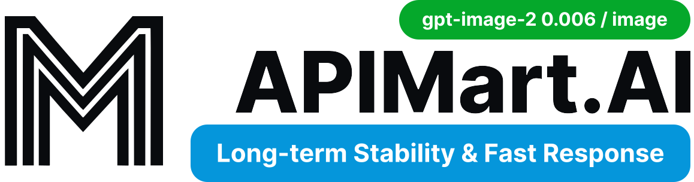

<!--  -->

# Base UI Vue

Base UI Vue is an unstyled UI component library for building accessible user interfaces.

---

## Sponsors

Base UI Vue is an open-source project supported by our sponsors. If you'd like to support its development, consider becoming a sponsor, supporting us on [GitHub Sponsors](https://github.com/sponsors/vuepont), or contributing through [Open Collective](https://opencollective.com/vuepont).

<table>
  <tr>
    <td width="180"></td>
    <td>Thanks to ImmiTranslate for sponsoring this project! ImmiTranslate provides on-demand certified translation services powered by professional human translators and supported by AI. It translates documents in 70+ languages for immigration and legal, academic, financial, and medical use, with notarization and physical delivery options available. <a href="https://immitranslate.com/">Visit ImmiTranslate</a> to learn more.</td>
  </tr>

  <tr>
    <td width="180"></td>
    <td>Thanks to APIMart for sponsoring this project! APIMart is a low-cost API platform for AI image &amp; video generation — GPT-Image-2 from $0.006/image, 160+ images per dollar. One async API covers both image and video: submit a task, get an ID, fetch results via polling or callback. Batch tens of thousands of images without timeouts, switch models without changing code. Pay-as-you-go with no monthly fee — <a href="https://go.apimart.ai/gh-ai-elements-vue">sign up here</a> to get started.</td>
  </tr>
</table>

## Documentation

To get started, check out the [Base UI Vue documentation](https://baseui-vue.com/docs/overview/quick-start).

## Contributing

Read our [contributing guide](/CONTRIBUTING.md) to learn about our development process, how to propose bug fixes and improvements, and how to build and test your changes.

## Releases

To see the latest updates, check out the [releases page](https://github.com/vuepont/base-ui-vue/releases).

## Community

- **Discord** For community support, questions, and tips, join our [Discord](https://discord.gg/SWzhwGMxsZ).
- **X** To stay up-to-date on new releases and announcements, follow [Raymond on X](https://x.com/peoray_) and [Charlie on X](https://x.com/cwandev).

## Team

- **Charlie Wang** [@cwandev](https://x.com/cwandev)
- **Emmanuel Raymond** [@peoray](https://x.com/peoray_)

## License

This project is licensed under the terms of the [MIT license](/LICENSE).
